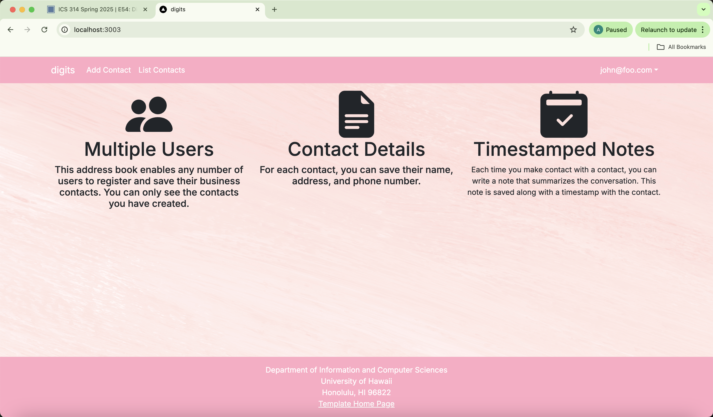
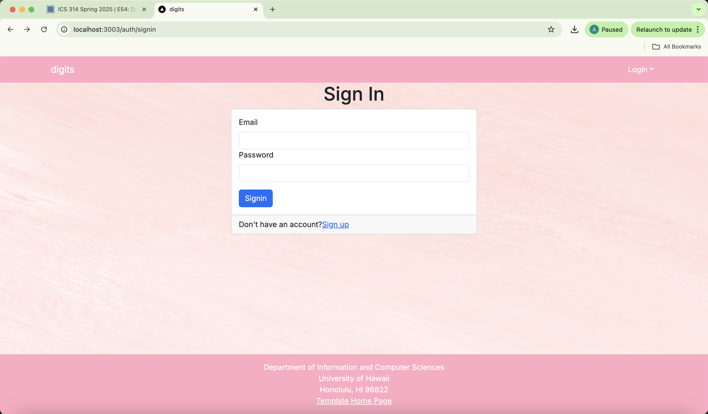
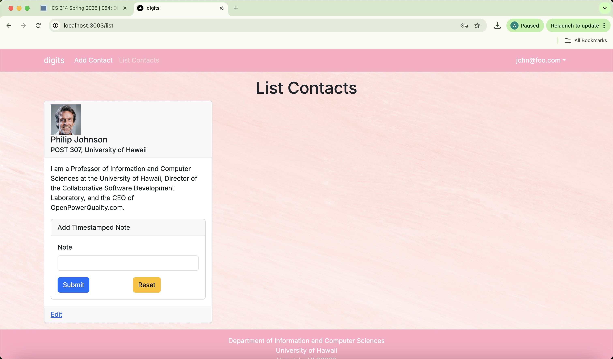
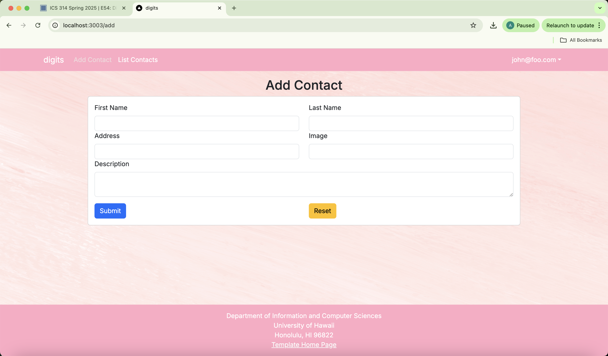
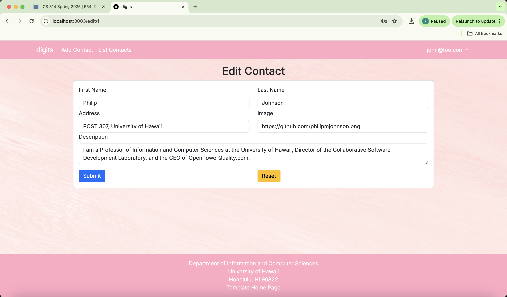
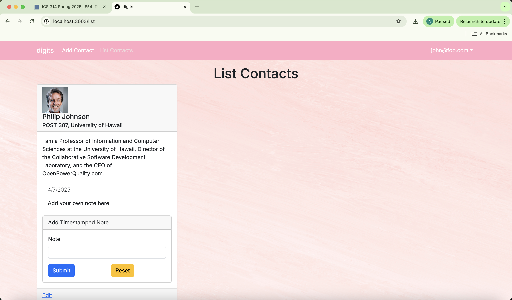
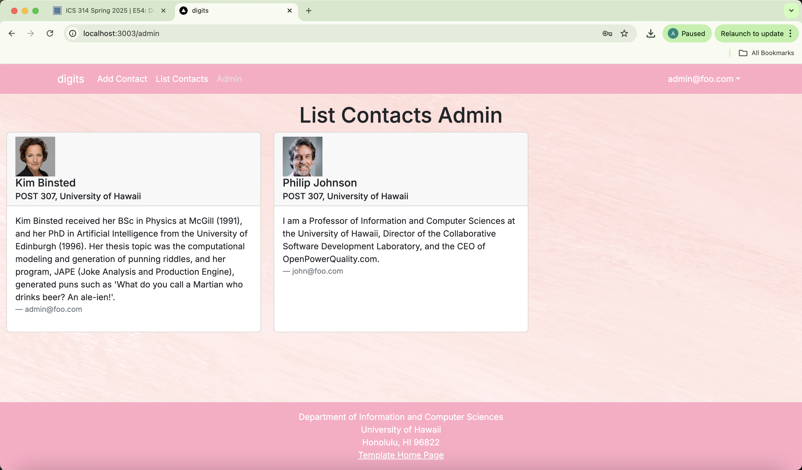

## Installation

First, [install PostgreSQL](https://www.postgresql.org/download/). Then create a database for your application.

```

$ createdb digits
Password:
$

```

Second, go to [https://github.com/ics-software-engineering/nextjs-application-template](https://github.com/ics-software-engineering/nextjs-application-template), and click the "Use this template" button. Complete the dialog box to create a new repository that you own that is initialized with this template's files.

Third, go to your newly created repository, and click the "Clone or download" button to download your new GitHub repo to your local file system. Using [GitHub Desktop](https://desktop.github.com/) is a great choice if you use MacOS or Windows.

Fourth, cd into the directory of your local copy of the repo, and install third party libraries with:

```

$ npm install

```

Fifth, create a `.env` file from the `sample.env`. Set the `DATABASE_URL` variable to match your PostgreSQL database that you created in the first step. See the Prisma docs [Connect your database](https://www.prisma.io/docs/getting-started/setup-prisma/add-to-existing-project/relational-databases/connect-your-database-typescript-postgresql). Then run the Prisma migration `npx prisma migrate dev` to set up the PostgreSQL tables.

```

$ npx prisma migrate dev
Environment variables loaded from .env
Prisma schema loaded from prisma/schema.prisma
Datasource "db": PostgreSQL database "<your database name>", schema "public" at "localhost:5432"

Applying migration `20240708195109_init`

The following migration(s) have been applied:

migrations/
└─ 20240708195109_init/
└─ migration.sql

Your database is now in sync with your schema.

✔ Generated Prisma Client (v5.16.1) to ./node_modules/@prisma/client in 51ms

$

```

Then seed the database with the `/config/settings.development.json` data using `npx prisma db seed`.

```

$ npx prisma db seed
Environment variables loaded from .env
Running seed command `ts-node --compiler-options {"module":"CommonJS"} prisma/seed.ts` ...
Seeding the database
Creating user: admin@foo.com with role: ADMIN
Creating user: john@foo.com with role: USER
Adding stuff: Basket (john@foo.com)
Adding stuff: Bicycle (john@foo.com)
Adding stuff: Banana (admin@foo.com)
Adding stuff: Boogie Board (admin@foo.com)

🌱 The seed command has been executed.
$

```

## Running the system

Once the libraries are installed and the database seeded, you can run the application by invoking the "dev" script in the [package.json file](https://github.com/ics-software-engineering/nextjs-application-template/blob/master/app/package.json):

```

$ npm run dev

> nextjs-application-template-1@0.1.0 dev
> next dev

▲ Next.js 14.2.4

- Local: http://localhost:3000
- Environments: .env

✓ Starting...
✓ Ready in 1619ms

```

### Viewing the running app

If all goes well, the template application will appear at [http://localhost:3000](http://localhost:3000). You can login using the credentials in [settings.development.json](https://github.com/ics-software-engineering/nextjs-application-template/blob/main/config/settings.development.json), or else register a new account.

### ESLint

You can verify that the code obeys our coding standards by running ESLint over the code in the src/ directory with:

```
$ npm run lint

> nextjs-application-template-1@0.1.0 lint
> next lint

✔ No ESLint warnings or errors
$
```

## Walkthrough

The following sections describe the major features of this template.

### 🗂️ Directory Structure

Here is a breakdown of the key folders and files:

```
.github/                  # GitHub CI workflows, issue templates
config/                   # Configuration files like settings.development.json
doc/                      # Screenshots and documentation
prisma/                   # Prisma ORM schema and seed script
public/                   # Public static assets (like images)
src/                      # Main app code
tests/                    # Playwright tests

.eslintrc.json            # ESLint configuration
.gitignore                # Files to ignore in git
.env                      # Environment variables
```

Inside `src/`:

```
src/
  app/
    add/                  # Add Contact page
    admin/                # Admin-only view of all contacts
    edit/                 # Edit Contact page
    list/                 # List user’s contacts
    not-authorized/       # Shown if access is denied
    auth/
      signin/             # Sign In page
      signup/             # Sign Up / Register page
      signout/            # Sign Out page
      change-password/    # Change Password page
    layout.tsx            # Page layout
    page.tsx              # Landing page
    providers.tsx         # Session providers

  components/
    AddContactForm.tsx    # Form to add a contact
    AddNoteForm.tsx       # Adds a timestamped note to a contact.
    EditContactForm.tsx   # Form to edit a contact
    ContactCard.tsx       # Displays a single contact (regular user)
    ContactCardAdmin.tsx  # Displays a contact (admin view)
    Navbar.tsx            # Navigation bar
    Footer.tsx            # Footer layout
    LoadingSpinner.tsx    # Shown while loading
    NoteItem.tsx          # This component displays a single note with its creation date and content using a Bootstrap ListGroup.Item

  lib/
    dbActions.ts          # Server-side DB actions (e.g. create, update, delete)
    prisma.ts             # Prisma client instance
    page-protection.ts    # Page protection functions
    validationSchemas.ts  # Yup schemas for validating form inputs
```

---

### Application functionality

The application implements a simple CRUD system for managing **Contacts**, each of which includes a first name, last name, address, image URL, description, and an owner (the user who created it). Users can also add short **notes** to any of their contacts.

By default, each user only sees the contacts that they have created. However, the settings file allows you to define default accounts. If you define a user with the role `"admin"`, then that user has access to a special admin page which displays all contacts created by all users.

#### Landing page
When you retrieve the app at http://localhost:3000, this is what should be displayed:


#### Login / Register
Allows users to log in to an existing account or create a new one.



#### List Contacts
Shows the user a grid of their added contacts (name, address, image, and description).



#### Add Contact
Users can fill out a form to add a new contact to their list.



#### Edit Contact
Users can click “Edit” on a contact card to update their information.



#### Notes
Users can attach short notes to any contact. Notes are displayed with timestamps.



#### Admin Page
Admins can view **all contacts** across all users. This page is only accessible to users with the `ADMIN` role.



### 🧾 Tables

The app uses three main tables:

- **User**
  - `id`, `email`, `password` (hashed), `role` (USER or ADMIN)

- **Contact**
  - `id`, `firstName`, `lastName`, `address`, `image`, `description`, `owner` (user email)

- **Note**
  - `id`, `note`, `contactId`, `owner`, `createdAt`

These are defined in `prisma/schema.prisma` and populated in `prisma/seed.ts`.

---
### CSS

The application uses the [React implementation of Bootstrap 5](https://react-bootstrap.github.io/). You can adjust the theme by editing the `src/app/globals.css` file. To change the theme override the Bootstrap 5 CSS variables.

```css
/* Change bootstrap variable values.
 See https://getbootstrap.com/docs/5.2/customize/css-variables/
 */
body {
  --bs-light-rgb: 236, 236, 236;
}

/* Define custom styles */
.gray-background {
  background-color: var(--bs-gray-200);
  color: var(--bs-dark);
  padding-top: 10px;
  padding-bottom: 20px;
}
```

### Routing

For display and navigation among its four pages, the application uses [Next.js App Router](https://nextjs.org/docs/app/building-your-application/routing).

Routing is defined by the directory structure.

### Authentication

For authentication, the application uses the NextAuth package.

When the database is seeded, a settings file (such as [config/settings.development.json](https://github.com/ics-software-engineering/nextjs-application-template/blob/main/config/settings.development.json)) is used to create users and stuff in the PostgreSQL database. That will lead to a default accounts being created.

The application allows users to register and create new accounts at any time.

### Authorization

Only logged in users can manage Contacts (but any registered user can manipulate any Stuff item, even if they weren't the user that created it.)

### Configuration

The [config](https://github.com/ics-software-engineering/nextjs-application-template/blob/main/config) directory is intended to hold settings files. The repository contains one file: [config/settings.development.json](https://github.com/ics-software-engineering/nextjs-application-template/blob/main/config/settings.development.json).

The [.gitignore](https://github.com/ics-software-engineering/nextjs-application-template/blob/main/.gitignore) file prevents a file named settings.production.json from being committed to the repository. So, if you are deploying the application, you can put settings in a file named settings.production.json and it will not be committed.

### Quality Assurance

#### ESLint

The application includes a [.eslintrc.json](https://github.com/ics-software-engineering/nextjs-application-template/blob/main/.eslintrc.json) file to define the coding style adhered to in this application. You can invoke ESLint from the command line as follows:

```
[~/nextjs-application-template]-> npm run lint

> nextjs-application-template-1@0.1.0 lint
> next lint

✔ No ESLint warnings or errors
[~/nextjs-application-template]->
```

ESLint should run without generating any errors.

It's significantly easier to do development with ESLint integrated directly into your IDE (such as VSCode).

<!--
## Screencasts

For more information about this system, please watch one or more of the following screencasts. Note that the current source code might differ slightly from the code in these screencasts, but the changes should be very minor.

- [Walkthrough of system user interface (6 min)](https://youtu.be/48xu1hrqUi8)
- [Data and accounts structure and initialization (18 min)](https://youtu.be/HZRjwrVBWp4)
- [Navigation, routing, pages, components (34 min)](https://youtu.be/XztTdHpv6Jw)
- [Forms (32 min)](https://youtu.be/8FyWR3gUGCM)
- [Authorization, authentication, and roles (12 min)](https://youtu.be/9HX5vuXTlvA)
-->
