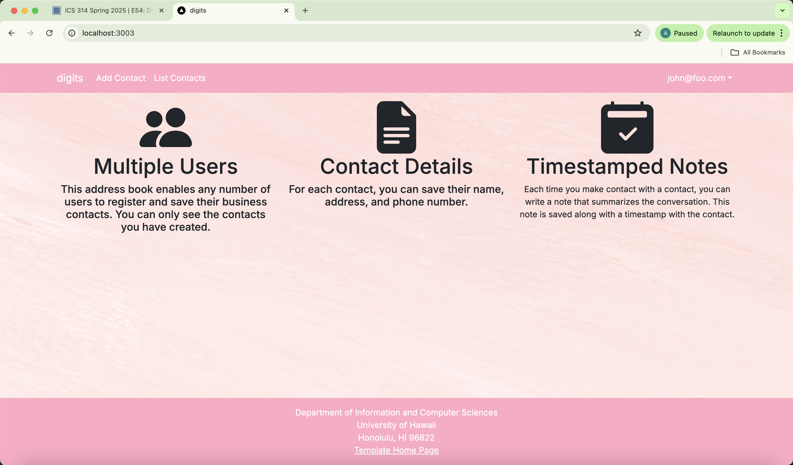

# Digits (Next.js Edition)

Digits is a full-stack web app where users can register, log in, and manage a list of contacts with details and notes. Admins have access to all user contacts via a special admin view. The app is built using:

- [Next.js 14](https://nextjs.org/)
- [React Bootstrap](https://react-bootstrap.github.io/)
- [React Hook Form](https://www.react-hook-form.com/)
- [NextAuth.js](https://next-auth.js.org/) for authentication
- [Prisma ORM](https://www.prisma.io/) with PostgreSQL
- [Sweet Alert](https://sweetalert.js.org/) for pop-up messages
- [ESLint](https://eslint.org/) with Next.js and Airbnb rules

---

## 🚀 Installation Instructions

1. Clone this repo:
   ```bash
   git clone https://github.com/your-username/your-digits-repo.git
   cd your-digits-repo
   ```

2. Install dependencies:
   ```bash
   npm install
   ```

3. Set up PostgreSQL and create a database:
   ```bash
   createdb digits
   ```

4. Run the Prisma migration:
   ```bash
   npx prisma migrate dev --name init
   ```

5. Seed the database:
   ```bash
   npx prisma db seed
   ```

6. Start the app:
   ```bash
   npm run dev
   ```

7. Visit the app at: [http://localhost:3000](http://localhost:3000)

You can log in using:
- `admin@foo.com` (Admin)
- `john@foo.com` (User)

---

## ✅ ESLint

You can check your code style using:

```bash
npm run lint
```

It should return:

```
✔ No ESLint warnings or errors
```

---

## 🧭 Walkthrough

### Landing Page
Displays a welcome message and login/register options.

### Login / Register
Allows users to log in to an existing account or create a new one.

### List Contacts
Shows the user a grid of their added contacts (name, address, image, and description).

### Add Contact
Users can fill out a form to add a new contact to their list.

### Edit Contact
Users can click “Edit” on a contact card to update their information.

### Notes
Users can attach short notes to any contact. Notes are displayed with timestamps.

### Admin Page
Admins can view **all contacts** across all users. This page is only accessible to users with the `ADMIN` role.

---

## 🗂️ Directory Structure

Here is a breakdown of the key folders and files:

```
.github/                  # GitHub CI workflows, issue templates
config/                   # Configuration files like settings.development.json
doc/                      # Screenshots and documentation
prisma/                   # Prisma ORM schema and seed script
public/                   # Public static assets (like images)
src/                      # Main app code
tests/                    # Playwright tests

.eslintrc.json            # ESLint configuration
.gitignore                # Files to ignore in git
.env                      # Environment variables
```

Inside `src/`:

```
src/
  app/
    add/                  # Add Contact page
    admin/                # Admin-only view of all contacts
    edit/                 # Edit Contact page
    list/                 # List user’s contacts
    not-authorized/       # Shown if access is denied
    auth/
      signin/             # Sign In page
      signup/             # Sign Up / Register page
      signout/            # Sign Out page
      change-password/    # Change Password page
    layout.tsx            # Page layout
    page.tsx              # Landing page
    providers.tsx         # Session providers

  components/
    AddContactForm.tsx    # Form to add a contact
    AddNoteForm.tsx       # Adds a timestamped note to a contact.
    EditContactForm.tsx   # Form to edit a contact
    ContactCard.tsx       # Displays a single contact (regular user)
    ContactCardAdmin.tsx  # Displays a contact (admin view)
    Navbar.tsx            # Navigation bar
    Footer.tsx            # Footer layout
    LoadingSpinner.tsx    # Shown while loading
    NoteItem.tsx          # This component displays a single note with its creation date and content using a Bootstrap ListGroup.Item

  lib/
    dbActions.ts          # Server-side DB actions (e.g. create, update, delete)
    prisma.ts             # Prisma client instance
    page-protection.ts    # Page protection functions
    validationSchemas.ts  # Yup schemas for validating form inputs
```

---

## 🧾 Tables

The app uses three main tables:

- **User**
  - `id`, `email`, `password` (hashed), `role` (USER or ADMIN)

- **Contact**
  - `id`, `firstName`, `lastName`, `address`, `image`, `description`, `owner` (user email)

- **Note**
  - `id`, `note`, `contactId`, `owner`, `createdAt`

These are defined in `prisma/schema.prisma` and populated in `prisma/seed.ts`.

---

## 🎨 CSS / Styling

The app uses [React Bootstrap](https://react-bootstrap.github.io/) for styling. You can override the default theme in:

```
src/app/globals.css
```

To customize styles, edit Bootstrap CSS variables or create your own utility classes.

---

## 🔐 Authentication & Authorization

- Authentication is handled by [NextAuth.js](https://next-auth.js.org/)
- Users can register and sign in
- Admins are seeded via `settings.development.json`
- Only admins can access the Admin page
- Protected routes use `page-protection.ts` for access control

---

## 🛡️ Quality Assurance

This project uses ESLint with the Next.js and Airbnb config. Run:

```bash
npm run lint
```

To ensure your code meets formatting and best practices.
